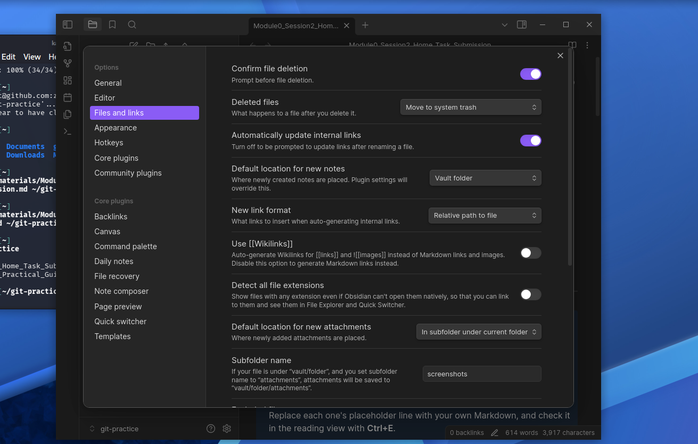
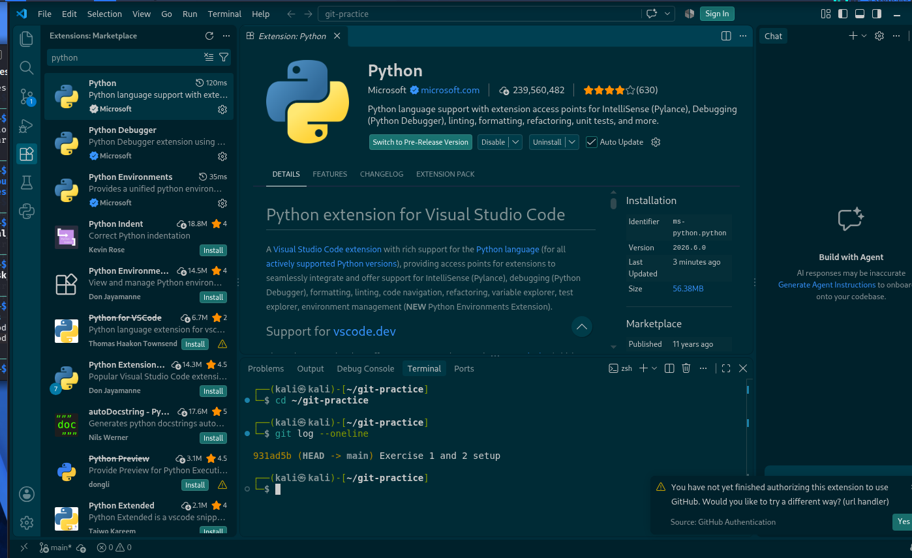
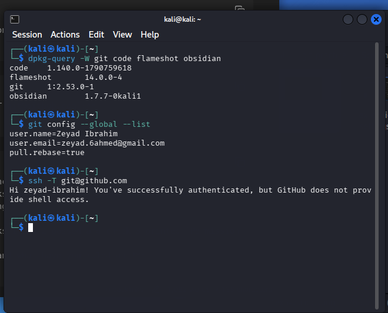
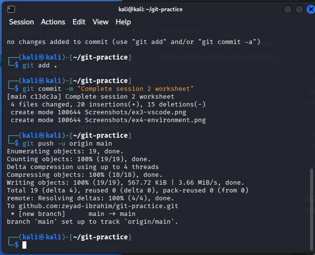
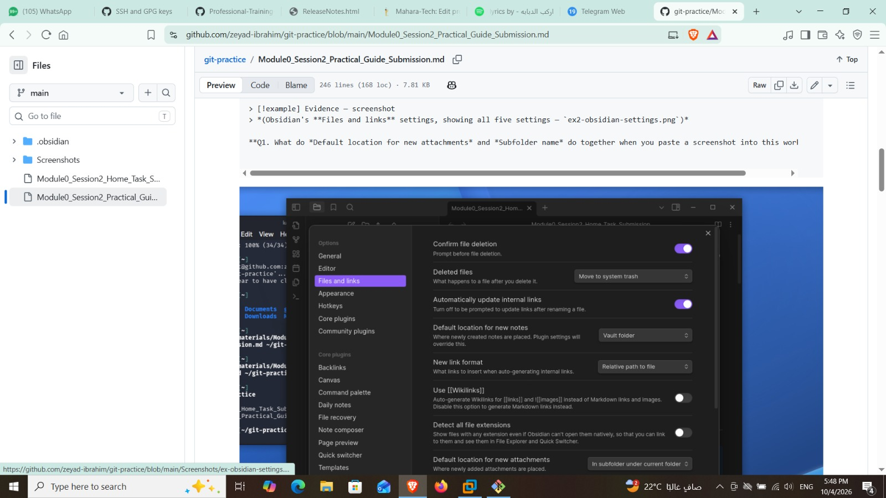

# Module 0 · Session 2 — Practical Guide Submission

## The Working Environment and the Submission Workflow

### Professional Training in Cybersecurity I

**Student Name:**

**Date:**

---

> [!note] How to use this submission
> This single file is your **graded artifact**.
> Work through the Practical Guide and paste your terminal output, screenshots and written answers into the slots below, in guide order.
> The setup steps before Exercise 1 have no slots of their own: Exercise 4 records all of them.
>
> **Screenshots are evidence you did the work yourself.**
> Pasted text can be copied from anywhere.
> A screenshot of your own machine cannot.
>
> - Capture with **Flameshot**, on the **Print Screen** key you set up.
> - Save each one in the `screenshots/` folder beside this file, under the name its slot gives, for example `ex4-environment.png`, and embed it with `` on its own line below its evidence callout, after a blank line.
>
> **Before you submit:** delete this note, then commit and push **this markdown file together with its `screenshots/` folder**.
> The paths inside this file are relative to that folder, so a file handed in alone shows empty boxes where your evidence should be.

---

# Required Exercises

---

## Exercise 1: Clone Both Repositories and Start the Session — REQUIRED

**Your `git remote -v` output, run in your own repository:**

```
origin  git@github.com:zeyad-ibrahim/git-practice.git (fetch)
origin  git@github.com:zeyad-ibrahim/git-practice.git (push)
```

> [!example] Evidence — screenshot
> *(the terminal from `cd ~/student-YOUR-USERNAME` down to the `git remote -v` output — `ex1-session-folder.png`)*

**Q1. You cloned two repositories.
Which one do you push to, which one do you only pull, and why does the course keep them apart rather than giving you one?**
' ' '
I push to my git-practice repository because it contains my own work. I only pull from course-materials because it is the course repository and I should not change the original files.

' ' '
```

**Q2. Suppose you had cloned your own repository with its HTTPS address instead of its SSH address.
What would have happened, and why?**

```
It would still clone, but pushing would use HTTPS authentication instead of my SSH key, so I would need another way to authenticate.
```

---

## Exercise 2: Set Up Obsidian and Fill In the Worksheet — REQUIRED

> [!example] Evidence — screenshot
> *(Obsidian's **Files and links** settings, showing all five settings — `ex2-obsidian-settings.png`)*

**Q1. What do *Default location for new attachments* and *Subfolder name* do together when you paste a screenshot into this worksheet?**

```

The screenshot will be saved inside a screenshots subfolder under the current folder, and Obsidian will insert a relative link to it in the worksheet
```

**Q2. Obsidian shows a `![[...]]` wikilink image perfectly well.
Why is *Use \[\[Wikilinks\]\]* turned off anyway?**

```
Because Markdown links are more portable and work better outside Obsidian, for example on GitHub
```

---

## Exercise 3: Set Up VS Code — REQUIRED

**Your `git log --oneline` output, run in VS Code's built-in terminal:**

```
931ad5b (HEAD -> main) Exercise 1 and 2 setup
```

**Q1. `git log --oneline` worked without a `cd`.
Why, and what would have happened if you had opened a folder that is not a repository?**

```
It worked because VS Code was opened in my git-practice repository. If I opened a folder that was not a Git repository, Git would show an error saying it is not a repository
```

**Q2. The extension's name already said *Python*.
Why did you also check its identifier before installing it?**

```
I checked the identifier to make sure it was the official Python extension from Microsoft and not another extension with a similar name
```

**Q3. You trusted your repository's folder when VS Code asked.
What would you be allowing if you trusted a folder you downloaded from somewhere else?**

```
I would be allowing code, tasks, extensions, or scripts from that folder to run with more permissions in VS Code, so I should only trust folders from sources I know
```

---

## Exercise 4: Verify the Environment — REQUIRED

**Check 1 — `dpkg-query -W git code flameshot obsidian`:**

```
code    1.140.0-1790759618
flameshot       14.0.0-4
git     1:2.53.0-1
obsidian        1.7.7-0kali1

```

**Check 2 — `git config --global --list`:**

```
user.name=Zeyad Ibrahim
user.email=zeyad.6ahmed@gmail.com
pull.rebase=true
```

**Check 3 — `ssh -T git@github.com`:**

```
Hi zeyad-ibrahim! You've successfully authenticated, but GitHub does not provide shell access.
```

> [!example] Evidence — screenshot
> *(all three checks in one terminal, captured with Print Screen — `ex4-environment.png`)*

**Q1. Suppose checks 1 and 2 passed and check 3 printed `Permission denied (publickey)`.
What do you know, and what have you ruled out?**

```
Checks 1 and 2 show that the required tools are installed and Git is configured correctly. If check 3 failed with Permission denied (publickey), the problem would most likely be with the SSH key or GitHub authentication
```

**Q2. Check 3 did not ask about GitHub's fingerprint this time.
Why not, and what should you conclude if it ever asks again on this machine?**

```
It did not ask because GitHub’s host key was already saved on my machine from the first connection. If it asks again on the same machine, I should check the fingerprint before accepting because the host key may have changed or something may be wrong.
```

---

## Exercise 5: Push the Worksheet and Confirm It Arrived — REQUIRED

**Your !`git push` output:**

```
To github.com:zeyad-ibrahim/git-practice.git
 * [new branch]      main -> main
branch 'main' set up to track 'origin/main'.
```

**Your `git status` output, after the push:**

```
(paste output here)
```

> [!example] Evidence — screenshot
> *(this worksheet open on GitHub, showing at least one of its pictures — `ex5-github.png`)*

**Q1. Before the push, `git status` printed both `Your branch is ahead of 'origin/main'` and `nothing to commit, working tree clean`.
Which line decides whether your work counts at the deadline, and why?**

```
On branch main
Your branch is up to date with 'origin/main'.

nothing to commit, working tree clean
```

**Q2. Why does the course judge the deadline by what is on GitHub rather than by the time on each commit?**

```
Because GitHub is the version the course can actually see. A commit can be made before the deadline but if it is not pushed, it has not really been submitted
```

**Q3. You can delete a file from your repository at any time.
Why check your screenshots for a password, key or token before pushing, rather than after?**

```
Because once a password, key, or token is pushed to GitHub, it can remain in the commit history even if I delete the file later. It is safer to check before pushing so secrets are never uploaded
```

---

## Exercise 6: Hand In the Session 1 Worksheets — REQUIRED

**Your `ls -R Module0-Foundation/Session1` output:**

```Module0-Foundation/Session1:
Module0_Session1_Home_Task_Submission.md        screenshots
Module0_Session1_Practical_Guide_Submission.md

Module0-Foundation/Session1/screenshots:
```

> [!example] Evidence — screenshot
> *(the `Module0-Foundation/Session1` folder on GitHub, showing both worksheets and the `screenshots` folder — `ex6-session1-github.png`)*

**Q1. Why was the shared folder read-only, and why did you remove it once the files were copied?**

```
The shared folder was read-only so I could copy the original files without accidentally changing them. I removed it after copying because I no longer needed the shared source
```

**Q2. Why did you copy the two worksheets and the `screenshots` folder by name, rather than the whole shared folder?**

```
I copied only the two worksheets and the screenshots folder because those are the required submission files. Copying the whole shared folder could include extra files that are not needed
```

---

## Anything that failed

If something did not work, describe it here: **the exact step, the exact message, and what you tried.**
This is not a penalty.
A failure you can describe is a two-minute fix, and describing it accurately is a graded skill in this course.

```
(your answer here, or "nothing failed")
```

---

## AI Assistance

One line, **required either way**: `None`, or the AI assistant you used and what you used it for, for example *"to explain the error `git push` printed"*.
Using one for learning, explanation or debugging is allowed.
Not disclosing it is an integrity violation.

```
(None, or: which assistant, and what for)
```
